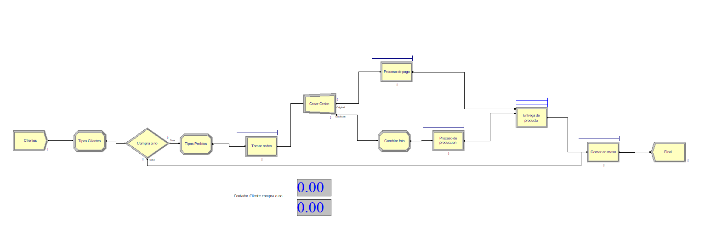

# Informe Punto Monis
Maria Jose Aponte - Santiago Botero -  Agustin Sierra
 - [Informe Tecnico](#informe-tecnico)
   - [Objetivo](#objetivo)
   - [Software escogido](#software-escogido)
 - [Levantamiento del proceso](#levatamiento-del-proceso)
 - [Diagrama de flujo](#diagrama-de-flujo)
## Informe Tecnico
Para este proceso de simulación se han tomado en cuenta todos los datos proporcionados por el profesor con su respectivo análisis para la generación de la simulación. Esta simulación se hace con el fin de entender y mejorar el proceso de compra de punto monis dentro de las instalaciones de la universidad de la sabana.

### Objetivo
El objetivo de este proyectoes realizar una simulacion del caso ppunto monis el cual esta expuesto en el documento anexado al final.
Se busca es la implementacion de un modelo de simulacion en un software especialido para ese fin para la demostracion del conocimiento en el uso de el.
Ahora bien tabien se encuentra como objetivo la comprobacion de aprendisaje de metodos y herramientas ademas del software aprendidos durante el semestre.

### Software escogido
EL software escogido para la simulacion fue Arena, esto bajo el criterio que el equipo se sentia mas agusto con el el uso de esta herramienta ya que se considera mas sencillo y con una mejor interfas de usuario, ademas dek hecho de que durante el curso se manejo y se explico a mayor profundidad esta herramienta.

## Levantamiento del proceso

Sensor digital de temperatura TMP36.

- Temperatura: -50°C - +125°C.
- Estable con grandes capacidades de carga.
- ±2°C de exactitud.
- Funcinal con voltajes desde 2.7 V hasta 5.5 V.

En nuestro caso se hara recepcion de los datos por medio del pin A0 de la placa Arduino Uno Rev3. 

Referencia: [TMP36 Datasheet](https://pdf1.alldatasheet.com/datasheet-pdf/view/49108/AD/TMP36.html) 

## Diagrama de flujo

A cotinuacion se presenta el diagram de flujo del modelo de simulacion:

## Anexos

[Caso 3 Punto Monis recargado corto ](https://unisabanaedu.sharepoint.com/:w:/s/Section_36800134182135/EbprapHMvWlEpk2j5Xq1CkABdqqjtpGeuw52pwaJFF1KFA?e=M4B68J) 
[Simulacion Arena ](./Proyecto-Simulacion-AMS.doe)

